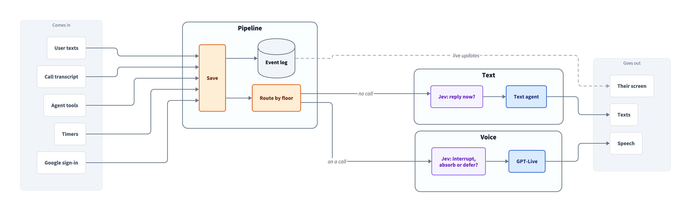
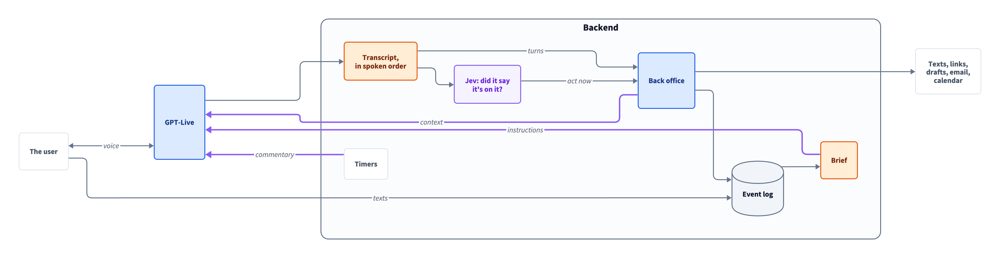

# Persona onboarding take-home

Joshua | scaryjoshie@gmail.com

A web simulation of Persona's onboarding. It texts you first, gets you to name it, tries to hop on a voice call to learn your name and one thing you need, connects Gmail, and then shows it's useful by finding something in your inbox that matches what you said. After that it can keep working your email and calendar. Text is the fallback at every step: you can decline the call, hang up, drop, go quiet, or never pick up, and it carries on by text with full context.

## Links

- **Demo:** https://persona-onboarding.fly.dev/
  User identification is handled via fake phone numbers you enter at the beginning. If you want to reset, reload the page and enter another phone number.
- **GitHub:** https://github.com/scaryjoshie/persona-takehome

## Scope

- **Main goal:** make calls and texts feel like talking to the same agent, not two different agents with different abilities. You can text while on a call, the voice hears about it without having to go check, and it can do anything the text agent can (send links, draft and send email) without leaving the call.
  - GPT Live 1 def has limitations, but I felt it was the most conversational.
- **Secondary goal:** an extendable architecture for text/voice, where it's easy to add things like background agents, integrations, and browser use.
- (Hopefully) follows the onboarding flow as specified.
- Can draft and send emails, and sends an image of each draft so you can check it before saying yes. Drafts are persisted, so sending is done by reference to the saved draft; the agent never re-types the email to send it.
- Can read and add calendar events.

### Planned (not on main)

- Persistent memory beyond name and the onboarding answers.
- Background agents for browser tasks, e.g. logging into Slack and other apps.

## Notes

- **iPhone-compatible:** we try not to show/do anything that iMessage cannot show/do. Exception: I show the live transcripts for voice and also for messages, which helps with debugging.
- **Libs & infra:** Python w/ FastAPI, GPT Live 1 (voice) w/ `gpt-6-sol` (texts + tools), Jev, SQLModel + SQLAlchemy; frontend is React + Vite. Running on a single fly.io server, with a SQLite store and no Redis-type mem. If this were to be productionized, SQL, Redis & S3 type stores would probably need to be used. This would allow everything except background agents to be stateless.
- **Jev everywhere:** Jev is used very often for micro-decisions, like deciding if the model should keep typing if the user starts typing, or catching the moment the voice says it's on something so the Call Agent can act. I think fast & cheap decision models like Jev can be utilized very powerfully in voice. See the diagrams below for how Jev is used.
- **Persistent objects:** email drafts are stored objects with their own preview image. If you don't want to define a set of objects to present within messages and keep that synced with persistent objects on the backend, there could be an abstract `PersistentObject` type that defines its own presentation image + storage behavior within its own S3 "folder".

## Architecture

### Overall (simplified)



Notably, everything is handled as an event.

- **One event stream per user** (SQLite) is the source of truth. Texts, call transcript lines, tool calls, timers and the Google sign-in are all events; each is saved, then the Router sends it to whichever side has the floor (text, or voice during a call). Text and voice read the same log, so the agent is one person across channels.
- **Text:** a Jev filtration head decides whether to reply now or wait (debounce, or Jev says the message is clearly finished); then one agent run replies with 0–4 bubbles.
- **Onboarding steps** are objectives (`backend/app/agent/objectives.py`, words in `backend/app/agent/prompts/objectives/`): only the open step's guidance is shown, with scripts reserved for fixed moments.

#### Why events

Everything is event-driven and immediately persisted. Events are the unit by which actions are handled. Context is mostly read in a stateless manner.

- **Probably scalable:** this should scale well on serverless, since any instance can handle an event: actions are a function of context + the most recent event + active processes (held statefully now, would move to Redis).
- **Easy routing:** events live in one stream, so routing to the text or call handler is simple control flow.
- **Efficient passing of event deltas:** filtering and categorizing events with Jev is an extremely cheap way to decide whether the expensive work of writing texts should be interrupted and restarted, or whether to prompt it after or just add to context.
- **Very extendable:** more than user texts and calls can come in. Calendar notifications, updates from background agents, or things the agent is monitoring can stream through the same pipeline; Gmail sign-ups already do.

At scale some tiered system may be needed, where events to the main stream are heavily summarized, but this design is reasonable for onboarding. GPT-Live audio does not route through event deltas; its transcripts and actions do.

### Calls (voice handler logic)



Designed so GPT Live 1, which is very conversational, can constantly receive information without having to delegate, which it is not very good at. Jev is used to determine when an LLM should act.

- The GPT-Live Session talks and listens (about 1s replies). It has no tools but hanging up; the **Call Agent** (our text model with the tools) acts during the call.
- **Two keys:** the Call Agent acts only when the user asked or agreed, *and* the voice then said it's on it ("texting you the link"). A Jev Commitment head catches that moment mid-sentence.
- The voice is kept current through Live's `instructions.append` (the Call Brief: what's known and the next step, sent only between turns), `thinking.append` (facts) and `commentary.append` (things to say now). This is what lets it avoid unjustified "let me check that".
- Call lines are read in spoken order (Live's turn ids), not log order.

Design notes and research from before the build are in `docs/proposed-design/` (the code is the current truth).

## Run it

```bash
# backend (Python 3.12+, uv)
cd backend
cp .env.example .env        # add OPENAI_API_KEY (required) and OPENROUTER_API_KEY (optional, enables Jev)
uv sync
uv run uvicorn app.main:app --port 8000 --reload --reload-include '*.md'

# frontend (Node 20+, pnpm)
cd frontend
pnpm install
pnpm dev                    # http://localhost:5173, proxies to the backend on :8000
```

Enter any 10-digit number on the first screen; each number is its own user. Chrome is the most reliable for the voice call (mic permission required).

To start everyone over (all conversations and progress, connected Google accounts revoked at Google, voice notes): `uv run python -m app.reset --yes` in `backend/` (without `--yes` it only counts). It backs up the database first and refuses during a live call. On Fly: `fly ssh console -a persona-onboarding -C "python -m app.reset --yes"`.

### Google (Gmail + Calendar)

The link the agent texts goes straight to Google's sign-in. It asks for Gmail (read, draft, send; never permanent delete) and Calendar events. The refresh token is stored encrypted (`CREDENTIALS_KEY`), so the agent can keep searching and reading email, drafting (and, after an explicit yes, sending) replies, and reading and adding calendar events. Tell the agent "disconnect my gmail" to revoke access.

Setup: a Google Cloud OAuth "Web application" client with the redirect URI `{APP_BASE_URL}/api/auth/google/callback`, the Gmail and Calendar APIs enabled, and `GOOGLE_CLIENT_ID`/`GOOGLE_CLIENT_SECRET`/`CREDENTIALS_KEY` in `backend/.env`. The deployed app is published but not verified by Google: anyone can connect after Google's "unverified app" warning (up to 100 users). In Testing mode instead, only the project's test users can connect.

## Testing

```bash
cd backend
uv run pytest -q && uv run ruff check app tests evals && uv run pyright

# against a running server on :8765 (reads live models; costs a little)
uv run python -m evals.scenarios   # ~40 scripted text edge cases → evals/out/scenarios/
uv run python -m evals.calls       # scripted voice calls (macOS `say`) → evals/out/calls/
uv run python -m evals.simulate    # LLM-played personas + a judge → evals/out/<time>.md
```
